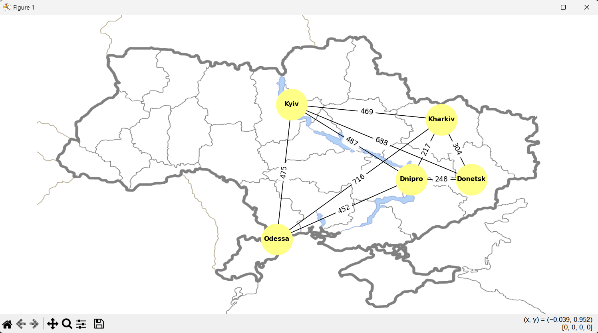

# Graphs

## Task 1

Create a graph using the NetworkX library to model a specific real-world network (e.g., a city's transportation network, a social network, or an internet topology).

> 📖 You can choose any real-world network at your discretion. If you cannot think of a realistic network, create a network that closely resembles reality.

Visualize the created graph and analyze its main characteristics (e.g., the number of nodes and edges, the degree of nodes).

## Task 2

Write a program that uses DFS and BFS algorithms to find paths in the graph developed in the first task.

Then, compare the results of both algorithms for this graph, highlighting the differences in the obtained paths. Explain why the paths differ for each algorithm.

> DFS and BFS traverse the graph differently, resulting in different paths. DFS goes deeper into the graph, visiting all neighboring vertices before moving to the next level, while BFS goes through the levels, visiting all vertices in the current level before moving to the next level. This is why the paths found by each algorithm may differ.

## Task 3

Implement Dijkstra's algorithm to find the shortest path in the developed graph. Add weights to the edges in the graph and find the shortest path between all nodes in the graph.
